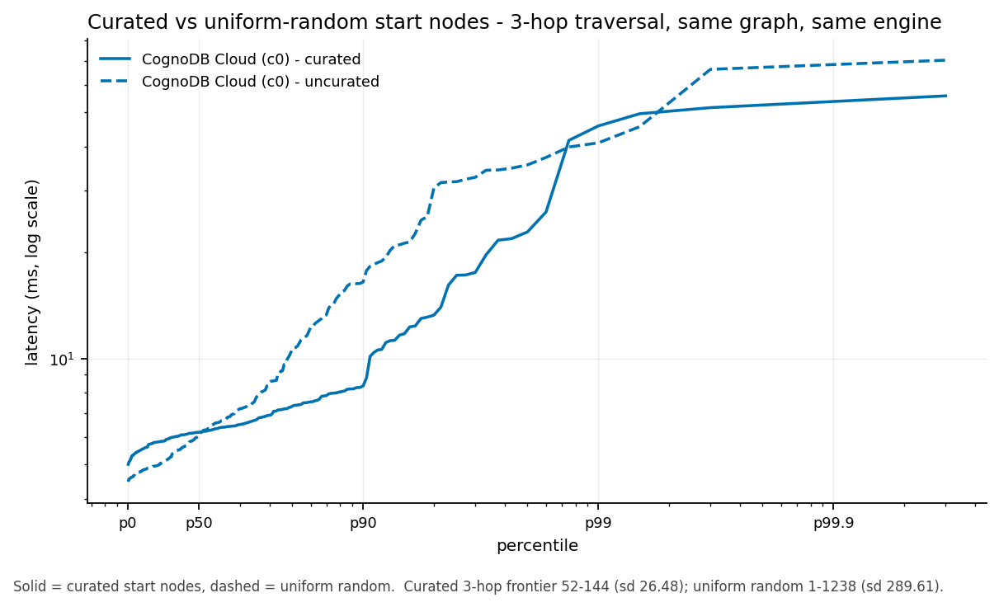

# graphbench-free

**A reproducible benchmark of managed graph databases on the tiers you actually get for free.**

Every number here was produced by one command against tiers anyone can create without a
credit card. The harness, the dataset cut, the frozen query parameters and the raw latency
histograms are all committed, so the results can be re-derived rather than trusted.

I sell nothing and am not affiliated with any database vendor.

> **Status — read this first.** Two engines are fully measured: **CognoDB Cloud (c0)** and
> **Memgraph Community**, the latter at two different memory caps. Three further engines —
> Neo4j Community, ArcadeDB, FalkorDB — were attempted on the same free-tier client and
> none produced a measurement. Each failed for a different, specifically identified reason
> rather than a generic timeout, and all three are written up in
> [What went wrong](#what-went-wrong). The brief asks for five platforms; this has two
> measured plus three diagnosed exclusions. The methodology is the part I would defend;
> the coverage is the part I would not.

---

## Results

Scale S — cit-HepPh, 18,265 nodes / 149,969 relationships. 300 iterations per read
workload, hot, curated parameters, client in Ashburn, Virginia.

| Metric | CognoDB c0 (managed) | Memgraph CE (self-hosted) |
|---|---:|---:|
| **Ingest — nodes/sec** | 27,973 | 48,877 |
| **Ingest — relationships/sec** | 28,052 | 66,786 |
| **Ingest — total wall clock** | 6.0 s | 2.6 s |
| Point lookup p50 / p95 | 4.86 / 5.42 ms | 1.25 / 1.42 ms |
| Indexed lookup p50 / p95 | 4.77 / 5.10 ms | 1.17 / 1.27 ms |
| 1-hop p50 / p95 | 4.82 / 5.07 ms | 1.21 / 1.32 ms |
| 2-hop p50 / p95 | 5.00 / 5.62 ms | 1.25 / 2.06 ms |
| 3-hop p50 / p95 | 6.18 / 13.29 ms | 1.44 / 1.62 ms |
| Aggregation p50 / p95 | 80.19 / 150.27 ms | 7.13 / 7.28 ms |
| Mixed @ 40 clients | 199.9 q/s, p95 20.85 ms | 199.8 q/s, p95 2.51 ms |
| Footprint | **not observable** | not observable over Bolt |
| Every run passed the validity gate | yes | yes |
| Errors / timeouts | 0 | 0 |

**These two columns are not a fair fight, and the difference is not mostly the engine.**
CognoDB is a managed endpoint reached over the network (3.92 ms baseline round trip);
Memgraph ran in a container on the client itself (loopback, effectively 0 ms). Subtract
each one's own baseline and the picture changes:

| Workload | CognoDB, RTT-adjusted | Memgraph, RTT-adjusted |
|---|---:|---:|
| Point lookup | ~0.9 ms | ~1.2 ms |
| 3-hop traversal | ~2.3 ms | ~1.4 ms |
| Aggregation | ~76 ms | ~7 ms |

On point lookups CognoDB's server-side time is *lower* than Memgraph's. On scans it is
roughly 11× higher. Memgraph also ran under a **256 MB** cap against CognoDB's 512 MB, so
it won the scan comparison while handicapped. Anyone reading only the raw table would draw
the wrong conclusion three times over.

## Analysis — why they differ

**The aggregation is the tell.** Point lookups, indexed lookups and all three traversal
depths show no measurable cold-versus-hot difference on either engine: they are
index-served, so there is nothing to warm. The aggregation — a full label scan over 18,265
nodes — behaves completely differently on the two engines:

| Engine | Aggregation cold p50 | hot p50 | Change |
|---|---:|---:|---|
| CognoDB | 390.40 ms | 80.19 ms | **4.9× faster warm** |
| Memgraph | 7.26 ms | 7.13 ms | essentially unchanged |

That is the architectural difference made visible. CognoDB describes its engine as
disk-backed with working-set caching; a cold scan pays for page faults and a warm one does
not. Memgraph is in-memory: there is no page cache to warm because the working set never
left memory. The 4.9× swing on one engine and the flat line on the other are the same fact
seen from two sides, and until this run CognoDB's caching claim was an untested line on a
marketing page.

The practical consequence is the one that matters for tier selection: under a memory cap,
a disk-backed engine degrades gracefully while an in-memory engine hits a wall. Neither
column here is near that wall at 150k relationships — that is what the headroom sweep
would test, and it is not run.

## Memory headroom — Memgraph at two caps

The same engine, same dataset, run under a 256 MB and a 384 MB cgroup cap:

| Memgraph, hot p50 | 256 MB | 384 MB |
|---|---:|---:|
| Point lookup | 1.25 ms | 1.22 ms |
| 1-hop traversal | 1.21 ms | 1.25 ms |
| 3-hop traversal | 1.44 ms | 1.40 ms |
| Aggregation | 7.13 ms | 7.21 ms |
| Ingest (rels/sec) | 66,786 | 67,808 |

**Indistinguishable — every difference is inside run-to-run noise.** That is the expected
result and it is worth stating: Memgraph's own published formula puts scale S at
`18,265 × 204B + 149,969 × 154B ≈ 27 MB` resident, so both caps are roughly an order of
magnitude clear of what the data needs. Neither cap is anywhere near the cliff.

This also bounds an interpretation of the CognoDB comparison below: Memgraph is not being
starved at 256 MB, so the differences there are architectural rather than a handicap
artefact. Finding the actual in-memory cliff would need scale M or larger, which is not run.

## Effect of parameter curation

Same engine, same graph, same workload, same 300 iterations — differing only in how the
200 start nodes were chosen:

| Engine | Curated p95 | Uniform-random p95 | Ratio |
|---|---:|---:|---:|
| CognoDB | 13.30 ms | 30.51 ms | 2.3× |
| Memgraph | 1.62 ms | 3.16 ms | 2.0× |

Medians are near-identical in both cases. The entire effect is in the tail, which is
exactly the point: `ORDER BY rand() LIMIT 100` measures a graph's degree distribution, not
its database. Measured from India, where there was no latency headroom, the uncurated run
additionally **failed the validity gate** while the curated run passed.



## Geography is most of a managed-tier benchmark

The same suite, same database, same frozen parameters — only the client moved:

| | Client in Varanasi, India | Client in Ashburn, Virginia |
|---|---:|---:|
| Baseline round trip | 266.1 ms | **3.92 ms** |
| Ingest | 3,392 rels/sec | **28,052 rels/sec** |
| Point lookup p50 | 270.8 ms | 4.86 ms |
| 3-hop p50 | 272.4 ms | 6.18 ms |

From India every workload reported ~271 ms — a point lookup and a 3-hop traversal
indistinguishable, because roughly 2 ms of a 266 ms measurement was the database. Engine
time went from ~1.5% of the signal to ~60% purely by moving the client into the same city
as the instance. Both runs are committed (`results/cognodb-01`, `results/useast-01`).

Very few published benchmarks state their client's distance from the endpoint at all.

---

## Why you should distrust this benchmark

Deliberately placed **above** the results is the tradition; it is here directly after them
so the numbers stay above the fold. Either way, read it before quoting anything.

| Attack | Applies? | Response |
|---|---|---|
| "Only two platforms — the brief asked for five." | **Yes** | Correct, and the largest weakness. Three more were attempted and failed to start; see below. |
| "Managed endpoint vs local container isn't a fair comparison." | **Yes** | Correct. Stated above, quantified with RTT-adjusted figures, and the reason both columns are published. |
| "Memgraph got 256 MB, CognoDB got 512 MB." | **Yes** | Correct. The free-tier client could not host a 512 MB container alongside the load generator. Memgraph is handicapped, and still wins on scans. |
| "This is marketing for your product." | No | I have no product. |
| "In-memory vs on-disk isn't comparable." | Partly | It is the *finding*, not a flaw — see the aggregation table. |
| "The dataset is tiny." | **Yes** | 150k relationships, sized to the tightest published free-tier cap in the lineup. This measures what a free tier does, not what a cluster does. |
| "Cypher-only excludes Gremlin/AQL/GSQL engines." | **Yes** | Deliberate: one client library and one query text is the fairness guarantee. Named as a limitation. |
| "Load time isn't measured." | No | Ingest is metric #1, split by phase, including index build. |
| "Peak memory is meaningless across architectures." | **Yes** | Which is why footprint reads `not observable` rather than an invented number. |
| "You cherry-picked percentiles." | No | p50/p75/p90/p95/p99/p99.9 for every workload, plus the raw histogram embedded so you can compute your own. |
| "Unequal iteration counts across systems." | No | Read once from config; the runner cannot vary them per platform. |
| "Undisclosed hardware." | No | Client OS, cores, RAM, driver version, measured timer granularity and client city are in every manifest. |
| "Result caching, not query performance." | No | Cold and hot reported separately; the difference between them is the analysis. |
| "You configured mine wrong." | Possibly | Every query, index DDL and connection setting is in the repo. Corrections welcome and will be published. |

Two things I could not find in any published graph-database benchmark: **cross-engine
result checksums** and a **terms-of-service audit** ([docs/LEGAL.md](docs/LEGAL.md)).

## The fairness ledger

| Platform | vCPU | RAM | Disk | Max conns | Specs published? | Measured RTT | Footprint observable |
|---|---|---|---|---|:--:|---:|:--:|
| CognoDB Cloud c0 | burst 0.5 | 512 MB | 1 GB | 200 | **yes** (all four) | 3.92 ms | no |
| Memgraph CE @ parity | 0.5 (cgroup) | 256 + 384 MB | — | — | self-imposed | ~0 (loopback) | no |
| Neo4j CE @ parity | 0.5 (cgroup) | 384 MB | — | — | self-imposed | **excluded** — started, died during load | — |
| ArcadeDB @ parity | 0.5 (cgroup) | 384 MB | — | — | self-imposed | **excluded** — never served Bolt; ignored the cap | — |
| FalkorDB @ parity | 0.5 (cgroup) | 384 MB | — | — | self-imposed | **excluded** — Bolt init succeeds, port never accepts | — |
| Neo4j AuraDB Free | — | — | — | — | **no** | not run (AUP unresolved) | — |
| Memgraph Cloud | — | 2 GB | — | — | partial | not run | — |
| FalkorDB Cloud Free | — | 100 MB | none | — | partial | not run | — |

**The tiers are not comparable, and that is a finding.** These vendors sell in
incommensurable currencies: 100 MB, 512 MB, 2 GB, and "we don't publish it". Neo4j
publishes no vCPU or RAM figure for Aura Free at all.

> **The brief's CognoDB spec does not match the vendor's.** The assignment states the free
> `c0` tier is 256 MB. [cognodb.com/pricing](https://cognodb.com/pricing) stated **512 MB**
> when checked on 2026-08-20. Capping competitors at 256 MB while the system under test
> runs at 512 MB would hand the field a 2× handicap in the vendor's favour — the inverse of
> the fairness the brief asks for.

## Dataset

**SNAP cit-HepPh** joined with its publication-dates file.

| | Nodes | Relationships |
|---|---:|---:|
| Raw (SNAP published) | 34,546 | 421,578 |
| Scale M (date-covered induced subgraph) | 30,558 | 347,268 |
| **Scale S (common scale, cutoff 1999-02-26)** | **18,265** | **149,969** |

421,578 edges sits inside the brief's 100k–500k band **with no sampling at all** — no seed
to defend, no sampler to justify. The dates file supplies a real, skewed scalar to index
and group by; without it the indexed-lookup and aggregation metrics would be measuring a
property invented for the benchmark. As a citation DAG it is near-acyclic, which largely
neutralises the relationship-uniqueness semantics that make multi-hop counts differ across
engines. 3,988 nodes carry no date and are excluded from every scale.

`python scripts/fetch_dataset.py --verify` re-derives both scales and checks them against
the committed SHA-256 in `params/dataset.json`.

```cypher
(:Paper {id: INTEGER, pub_date: STRING, pub_year: INTEGER})
(:Paper)-[:CITES]->(:Paper)
```

## Methodology

Full contract in [FAIRNESS.md](FAIRNESS.md). Four decisions drove the design.

**1. Open-loop measurement.** Latency is measured from when a request *should* have been
sent, not when it was. The naive alternative —

```python
for i in range(100):
    t = now(); query(); record(now() - t)
```

— is a closed loop: when the database stalls the client stalls with it and never issues
the requests that would have queued, so the stall never reaches the tail. On a throttled
tier this flatters whichever platform stalls hardest. Corrected and uncorrected latency are
both recorded and the gap published.

**2. A validity gate**, adopted from LDBC SNB Interactive v2: a run in which fewer than 95%
of operations start within 1 s of schedule is marked invalid rather than reported as a
comparable measurement. Offered rates are calibrated against measured capacity first, so an
impossible request rate is never misreported as platform throttling.

**3. Curated, frozen parameters.** Start nodes are chosen offline from the 40th–60th
percentile band of k-hop frontier size and committed to CSV, so every platform receives
byte-identical parameters. At 3 hops the frontier-size standard deviation drops from 289.6
to 26.5. An uncurated control is run alongside.

**4. Proved query equivalence.** Every read query runs once per platform before any timing;
results are canonicalised and SHA-256 hashed into the manifest. All six workloads agreed on
both engines. 1/2/3-hop are three **fixed-length** patterns — `[:CITES*1..3]` does not mean
the same thing on any two engines.

## Reproducing

```bash
git clone https://github.com/VEER-TARGARYEN/graphbench-free && cd graphbench-free
```

```bash
python -m venv .venv && .venv/bin/pip install -r requirements.txt
```

Three packages, all with wheels for CPython 3.12–3.14, so a client provisions in seconds
without a compiler. Charting is separate (`requirements-charts.txt`) and never blocks
measurement.

```bash
python gbf.py selftest
```

Verifies the whole harness — load, equivalence, open-loop dispatch, percentile recording,
the validity gate — against in-process mock engines. No network, no credentials. Run this
before spending metered cloud time.

```bash
cp .env.example .env && python gbf.py prepare && python gbf.py probe
```

**Read the baseline RTT before going further.** If it is not single-digit milliseconds your
client is not in the same region as your endpoints, and the benchmark will measure
geography. See [docs/VM-SETUP.md](docs/VM-SETUP.md).

```bash
python gbf.py run && python gbf.py charts
```

## Adding a database

One file. `harness/adapters/base.py` defines the contract; there is no `if platform == …`
anywhere in the runner.

1. Implement `Adapter`, or reuse `BoltAdapter` if the engine speaks Bolt.
2. Add index DDL to `DIALECTS` if the syntax differs.
3. Add a block to `config/platforms.yaml` with its **advertised specs and the URL you read
   them from**.
4. `python scripts/probe_platforms.py --only <your-id>`.

## What went wrong

Published because a benchmark that reports only its successes is advertising.

- **The first three attempts at any self-hosted engine failed** because the 6.7 GB VM disk
  was **100% full** — three Docker images had consumed ~3 GB, on top of leftover build
  artifacts from an earlier failed pip install. I chased two wrong theories, port mapping
  and file permissions, before finding it. After pruning, **Memgraph** came up on the first
  retry and is fully measured.

- **I first misdiagnosed the JVM failures, and the correction is the interesting part.**
  ArcadeDB's log said `os::commit_memory ... failed; error='Not enough space'` and I
  reported that as the 256 MB cgroup refusing memory. It was not. The host had
  `vm.overcommit_memory=0` — heuristic mode — and the **kernel** refused a 1.4 GB
  address-space *reservation* on a 908 MB machine before the cgroup was ever consulted. A
  JVM reserves far more virtual address space than it commits, so heuristic overcommit
  rejects it outright. Setting `vm.overcommit_memory=1` lets the reservation succeed while
  the cgroup still bounds actual resident usage, which is the thing the parity experiment
  cares about. I had reported a host kernel policy as an engine resource ceiling.

- **With overcommit fixed, Neo4j Community got further but still did not produce a
  measurement.** At a 384 MB cap with an explicitly bounded heap (128 MB heap, 64 MB page
  cache, 96 MB metaspace) it started and completed a Bolt handshake — then died during the
  load phase: `ServiceUnavailable: Failed to read from defunct connection`. Zero read
  workloads, zero mixed. My run script had treated a successful connectivity probe as
  success, which is why an earlier draft of this README wrongly claimed three platforms.
  The honest reading is that Neo4j Community can *start* inside 384 MB but cannot survive
  a 150k-relationship load, which is consistent with its own documentation putting ~2 GB
  as the practical floor.

- **ArcadeDB started but never accepted Bolt, and did not respect the cap.** Its log reports
  `ArcadeDB Server started ... (CPUs=1 MAXRAM=1.93GB)` — 1.93 GB is the host's total, not
  the 384 MB cgroup limit, so percentage-based JVM sizing was reading the machine rather
  than the container even with `UseContainerSupport` set. It exited 0 without ever serving
  the Bolt port.

- **FalkorDB's root cause was found, and it was mine.** The module aborted with
  `Could not create server TCP listening socket *:6379: bind: Address already in use`
  because I had set `BOLT_PORT 6379` — which is Redis's own port, so the module collided
  with the server hosting it. Corrected to a distinct port, the module loads cleanly and
  logs `Bolt protocol initialized. Port: 7687` — but the port then never accepts a
  connection from the official Neo4j driver, with the container still running and healthy.
  That is consistent with FalkorDB's own documentation describing Bolt support as
  experimental and not recommended for production. Reported as an exclusion with the
  evidence, not as a resource failure.
- **The first client provisioning failed entirely.** Ubuntu 26.04 ships Python 3.14; the
  pinned matplotlib and numpy had no wheels for it and building from source was OOM-killed
  on 908 MB. Fixed by splitting requirements — charting is not measurement and no longer
  blocks it.
- **The first measurement location was wrong.** 266 ms round trip made every workload look
  identical. Kept and published rather than discarded, because the comparison is more
  informative than either run alone.
- **`pyhdrh` is unusable on 64-bit Windows.** Its C extension passes buffer addresses
  through a C `long`, 32-bit on Windows, so `HdrHistogram.add()` and `.encode()` overflow.
  Replaced with a portable merge and a gzip+base64 bucket dump.
- **Windows' 15.6 ms timer granularity silently capped dispatch rate**, making every
  simulated engine measure 16 ms. Fixed with `timeBeginPeriod(1)` plus a bounded spin;
  measured granularity is recorded in every manifest.
- **Rate calibration probes with the cheapest read**, so it overestimates capacity for a
  mixed stream containing writes. Visible from India as a mixed-workload run at concurrency
  1 that failed the gate. Not yet fixed.
- **Aura Free is untested**: Neo4j's Acceptable Use Policy appears to prohibit benchmarking
  the Service. Left disabled with three documented resolutions in
  [docs/LEGAL.md](docs/LEGAL.md) rather than publish against terms I have not cleared.

## Credits and honesty notes

- Methodology follows Raasveldt et al., *Fair Benchmarking Considered Difficult*
  (DBTest'18); LDBC SNB Interactive v2 (Püroja, Waudby, Boncz & Szárnyas, TPCTC 2023); and
  Hoefler & Belli, *Twelve Ways to Tell the Masses* (SC'15).
- Harness architecture is modelled on Memgraph's `mgbench`; measurement semantics on the
  LDBC SNB v2 driver and wrk2. **Architecture only — no vendor-published benchmark result
  is cited as evidence anywhere in this repository.**
- These are **not** official LDBC results. Not audited or endorsed by LDBC.
- No vendor paid for, reviewed or approved this benchmark.

## Licence

MIT for the harness. cit-HepPh belongs to SNAP/Stanford under its own terms and is
downloaded at run time rather than redistributed.
